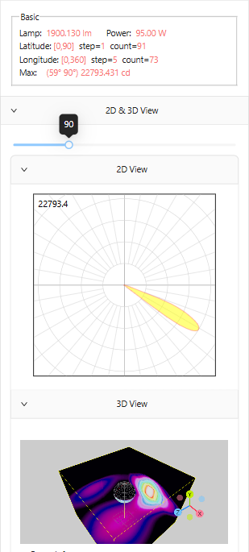
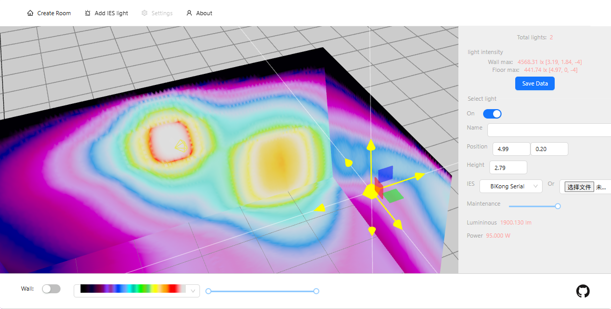
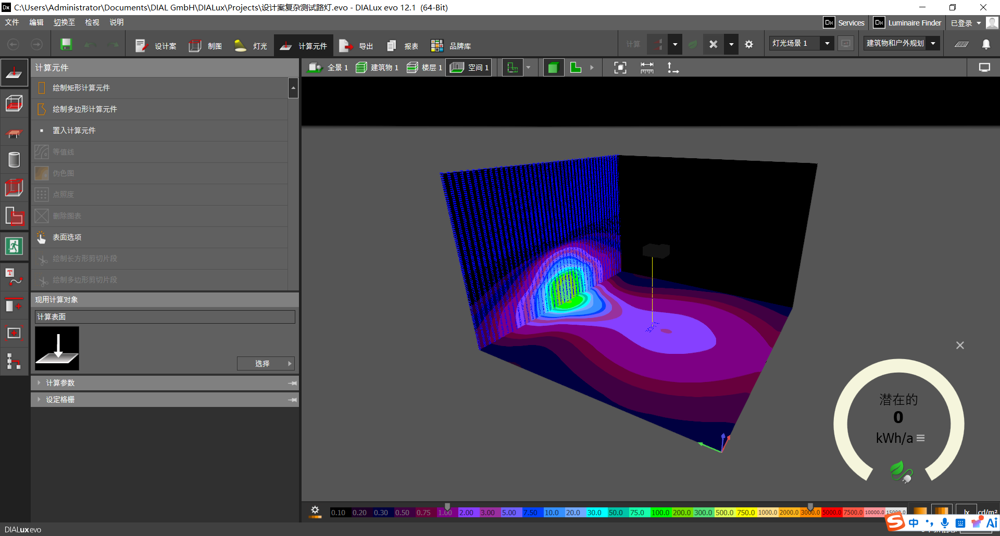
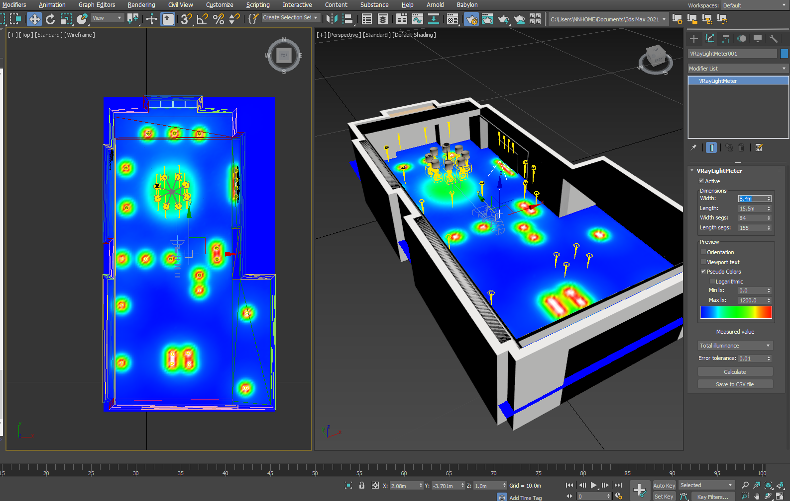
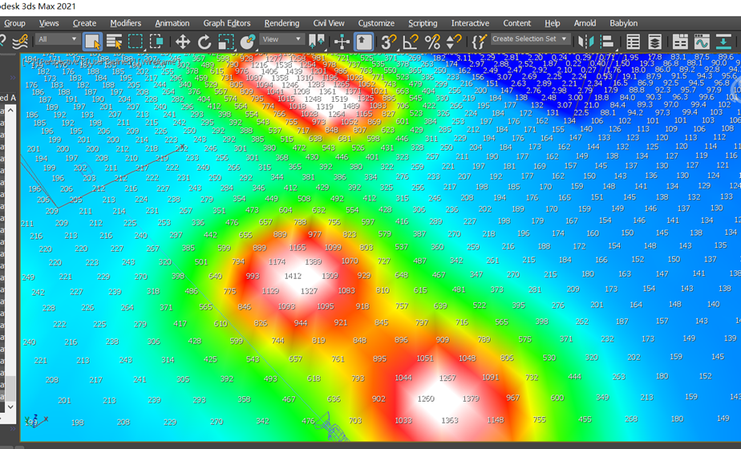

# IESViewer360
View IES photometric light in 2d and 3d

[English](README.md) | [中文](README.zh-CN.md)

## 项目介绍
这是一个基于three.js / svg 的web项目，用于查看IES文件，并展示其光学效果。

### 项目解决的问题
IES文件是一种用于描述光源的数学模型，它可以描述光源的形状、亮度、颜色、方向、距离、角度等信息。但是传统的IES查看工具是在2D平面内的极坐标光强分布, 通过控制角度来切换和观察3D空间中的光强分布。使用的非专业人士，用起来不直观，不方便, 本项目是用来解决IES文件在3D中的空间和数据查看以及数据导出等需求.

本项目有两个独立的页面展示, 分别是parser和simulator:

### IES parser
这个页面用于在手机上展示IES文件, 点击图片查看视频:

[](docs/ies_parser_1.mp4)

### IES simulator

这个页面用于在PC上使用IES文件进行房间内灯光照明的模拟及分析, 点击图片查看视频:

[](docs/ies_simulator_1.mp4)

## 项目背景

本项目最初是2024年初给欧普照明(OPPO)公司做的一个DEMO, OPPO是中国照明解决方案提供商, 在做照明产品的时候需要使用Dialux软件进行IES灯光的数据获取和分析, 但是Dialux软件对于非专业人士来说，使用起来复杂, 所以OPPO希望有一个简单易用的工具, 对IES文件以及场景进行可视化流明分析和房间照明数据的生成。

DIALUX解决方案:


项目的核心功能包括两点:
- IES文件解析和数据的获取
- 在3D空间的任意点进行IES流明数据的计算

IES文件是文本文件, 格式是IEEE 754 标准, 是公开的, 解析逻辑根据它的文档进行文本解析并转换数据, 目前最好的IES viewer地址是: *http://photometricviewer.com/*

另外一个重要的参考是3DMax 里面的Vray IES灯光, 下图展示了在max中进行vray模拟的图片:





为了计算出正确的空间点的照度, 计算工作是对照某个IES文件, 在max中进行照度模型,获得数据并和javascript里面的计算结果进行对比. 在计算的过程中遇到了一些问题, 我也邮件请教了photometricviewer的作者, 非常感谢 Andrey L的回复:

```text
Qutstions:

1. How to get the default lm value for an IES file: 
2. How to calculate the ies light meters values in lx , for a special point , like in 3dsmax and vraylightMeter object:i want to get the max value of the lx value in the ground: 
 

发件人: Andrey L <iesviewer@gmail.com> 
发送时间: 2024年3月19日 17:10 
收件人: chang yunhai <changyunhai@hotmail.com> 
主题: Re: ies questions, thanks 

Dear Chang, 

1) lumen (lm) is the integral of intensity (cd) over angles. Photometric file is a data set of intensity distributions at angles, so you need to integrate carefully using numerical methods and everything will work out; 

2) lux = n * Iv / (r*r), where Iv - intensity, r - distance, n - slope factor, if the beam falls vertically, then it is equal to 1. In general, if we take the reference angle (a) from the normal, then it will be n = cos (a). Calc lux over the entire surface to find the maximum. 

Regards, 

Andrey 
 
```

## 项目评估和经验

本项目主要用到的技术和知识:
- 计算机: 图形学, web3d展示技术
- 数学: 球面坐标系, 球面积分
- 物理: 光度学, 辐射度量学

在开发过程中查阅参考了大量的资料. 进行长时间的调试和边界检测计算.

### 项目的结果

在给OPPO做demo后, 由于一些原因, 项目没有进行下去, 项目本身可以进行参考.

## 项目试用

本项目是纯静态的web项目, 可以直接在浏览器中打开, 无需安装任何软件.

- IES parser: *https://changyunhai.github.io/IESViewer360/build-parser/index.html*

- IES simulator: *https://changyunhai.github.io/IESViewer360/build-simulator/index.html*

## 彩蛋
在我的weixin公众号记录了项目的前前后后，*https://mp.weixin.qq.com/s/7lEeliNidTE7Utg8z7EA9w* ， Enjoy reading 

